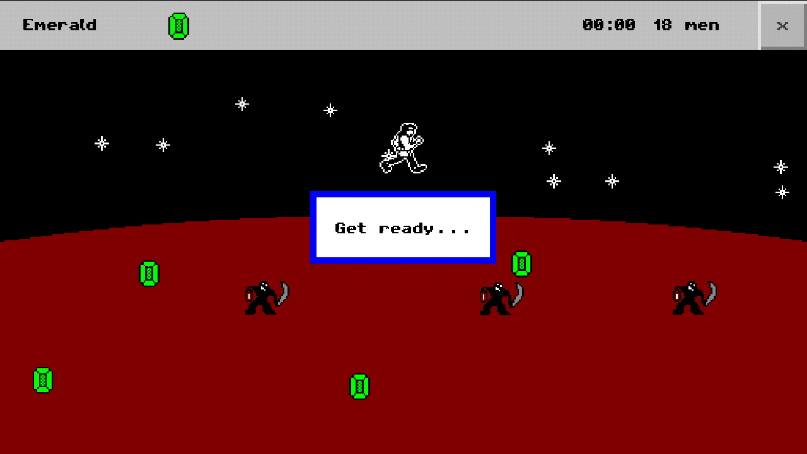
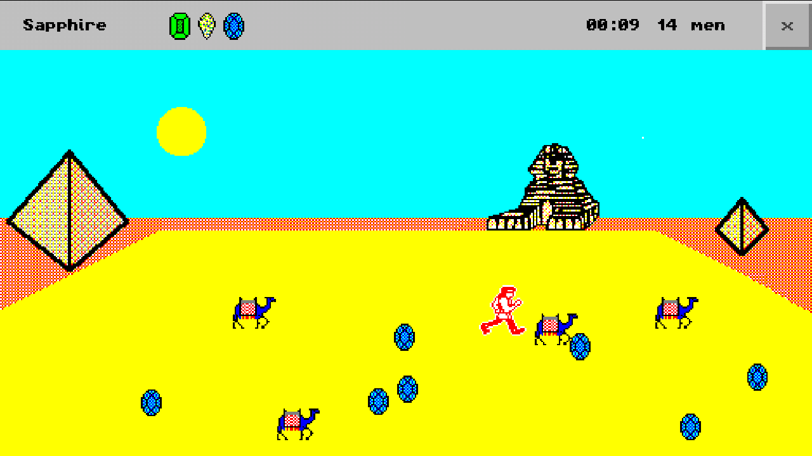
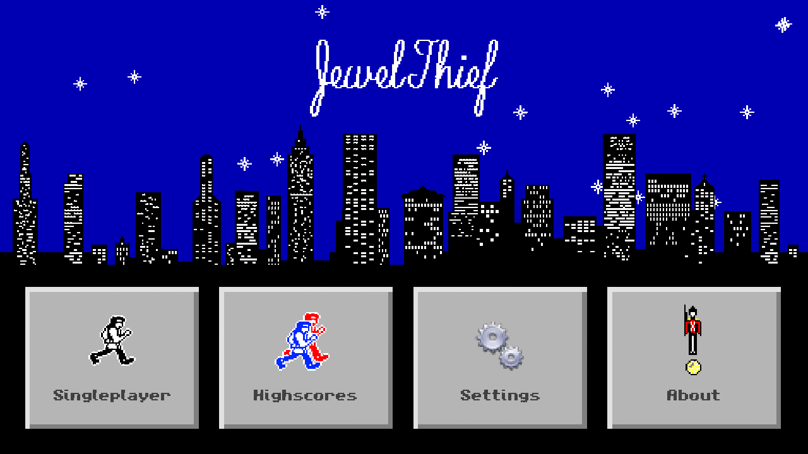
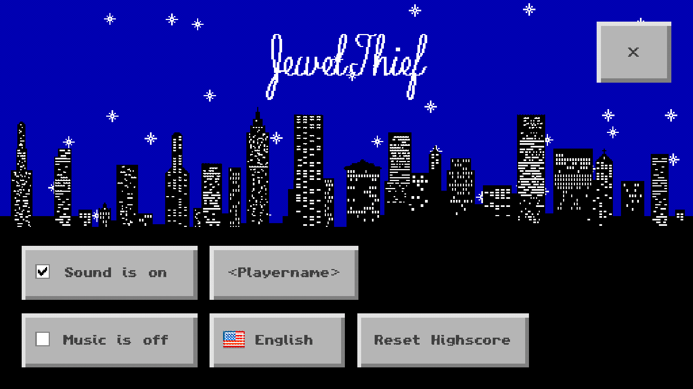
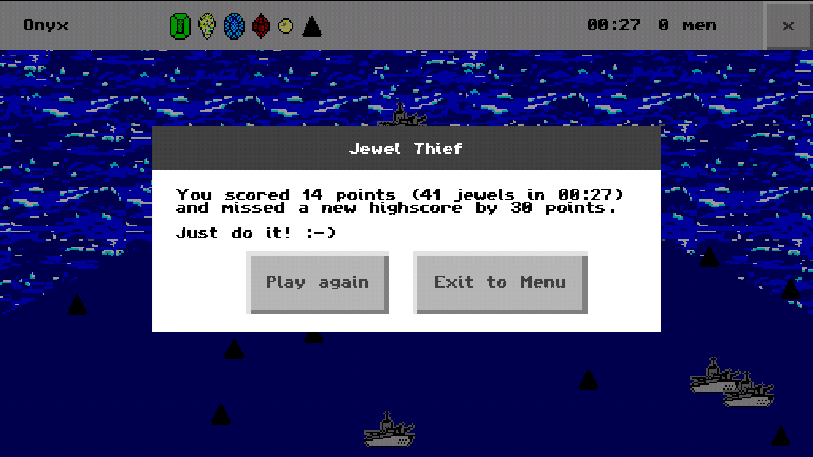
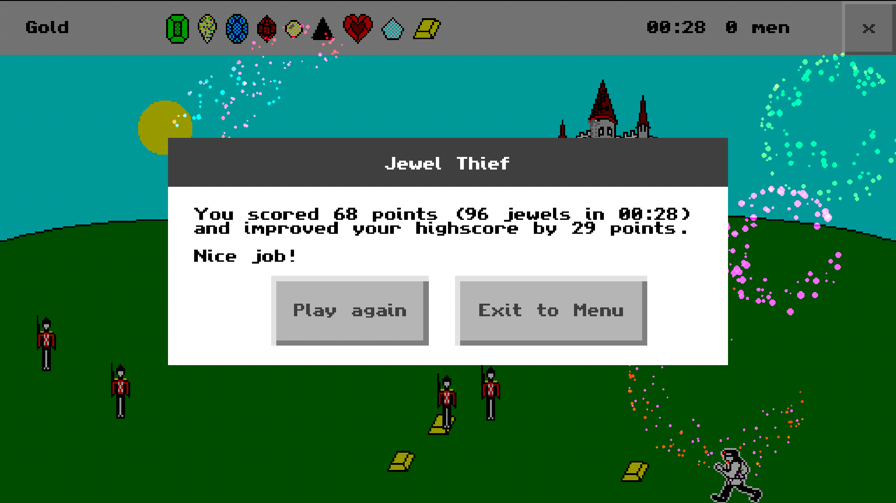

# Jewel Thief  

*This Android game is a remake of the legendary Jewel Thief game made by Paul Ligeski from ServantWare in 1991.*

The National Museum is in a tissy.
The country's jewel collection has been stolen and scattered all over creation.
Your mission is to travel to far away places and steal back the jewels from their unrightful owners.
As you leave your mother wishes you well and reminds you to be careful...

You can follow me on my <a href="https://goo.gl/U0x1Fy">development blog</a> for the latest news on this and other projects of mine.

## Download

App now available on Google Play Store.

## Promotion Video

Watch the promotion video showing in-game footage.

## Screenshots

## Gameplay

Collect all jewels as fast as possible and avoid guards and borders. You get extra men when you collect jewels.

**Tip**: Use only one finger to move around.

## Bugs, Problems, Feedback?

The more you tell me, the better my apps get. Please use the comments on <a href="http://goo.gl/l1lngU">Google Play Store</a> or visit <a href="http://goo.gl/KvKHze">my website</a> to post feedback. 

## Permissions

Your privacy is really important to me. The only permission that this app requires is internet access (android.permission.INTERNET). This is needed for the highscore list to function.

## License

Copyright &copy; 2016 Christian DeTamble

Licensed under the GNU General Public License, Version 3.0. See [LICENSE](LICENSE) for details.

    https://www.gnu.org/licenses/gpl-3.0.txt

'Jewel Thief' was a game made by Paul Ligeski from ServantWare in 1991. This app is a re-implementation for modern hardware using the original sprites and backgrounds.

* Game Idea, Sprites and Backgrounds by Paul Ligeski and ServantWare
* Applause Sound by Yannick Lemieux, CC BY 3.0
* Collect Sound by NenadSimic, CC BY 3.0
* Mouse Click, Party Whistle and Cymbal Sound by www.freesfx.co.uk
* Music by Chris Zabriskie, www.soundcloud.com/chriszabriskie, CC BY 4.0
* libGDX game development framework, Apache-2.0

***

Crafted with &hearts; in <a href="http://goo.gl/KvKHze">The Refactory</a> in Barcelona 2016.

(My software is and stays open source, free of charge and ad-free)
